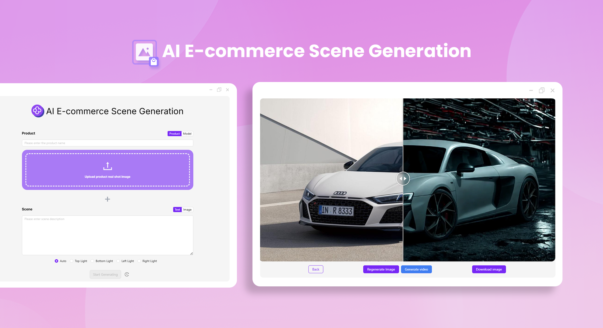
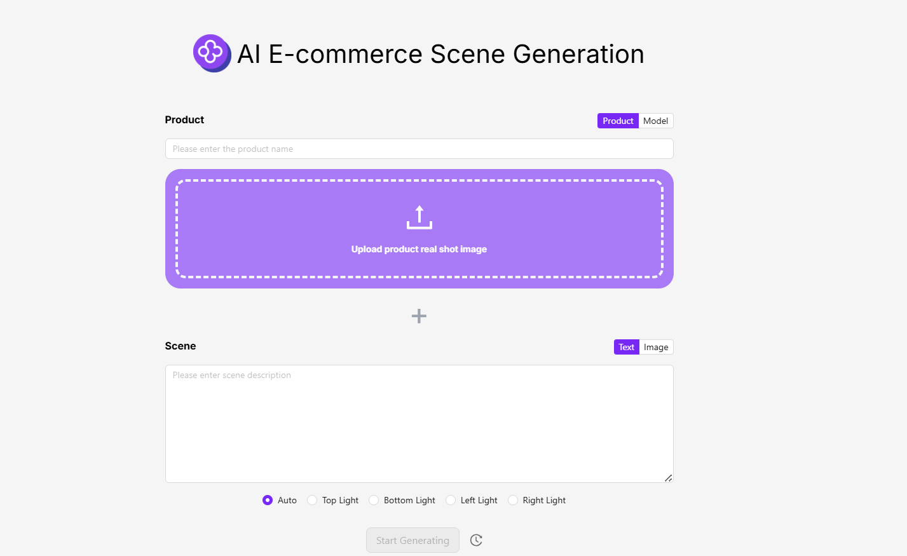

# 
🎥 AI E-commerce Scene Image Generator 🚀✨

The AI e-commerce scene picture generator re-lights the pictures according to the product pictures or model pictures provided by users, combined with different scene descriptions, and generates product pictures with consistent colors that are applicable to e-commerce or other industries. It can also generate videos of scene pictures.

<a href="README_zh.md">中文</a> | <a href="README.md">English</a> | <a href="README_ja.md">日本語</a>

This is the open-source version of the [AI E-commerce Scene Image Generator](https://302.ai/en/tools/ecom1/) by [302.AI](https://302.ai). You can log in to 302.AI to use the online version without coding skills, or modify and deploy it yourself according to your needs.

## Interface Preview
Perform secondary lighting on the pictures based on the provided product pictures or model pictures, combined with scene descriptions.
     

Generate e-commerce scene pictures, and it's also possible to generate videos of scene pictures.

## Project Features
### 🔆 Secondary Lighting
Generate model pictures or product pictures through the combination of pictures and text. Support secondary lighting for pictures. The following lighting modes are available for selection:
- Automatic
- Top Lighting
- Bottom Lighting
- Left Lighting
- Right Lighting 
### 🔄 Task Management
Tasks can be regenerated.
### ⚙️ Support for Multiple Models
Various models can be selected to expand pictures and generate videos.
### 📜 History Record
Your creation history will be saved so that memories won't be lost. You can download it anywhere and at any time.
### 🌍 Multi-language Support
- Chinese Interface
- English Interface
- Japanese Interface

## 🚩 Future Update Plans 
- [ ] Optimize color accuracy and coordination
- [ ] Add more creative scenes and styles

## Tech Stack
- Foundation framework Next.js 14

## Development & Deployment

1. Clone the project `git clone git@github.com:302ai/302_ecom_image_generator.git`
2. Install dependencies `pnpm install`
3. Configure 302's API KEY, refer to .env.example
4. Run the project `pnpm dev`
5. Package and deploy `docker build -t ecom_image_generator . && docker run -p 3000:3000 ecom_image_generator`

## ✨ Introduction to 302.AI ✨

[302.AI](https://302.ai) is a pay-as-you-go AI application platform that solves the last mile problem of AI for practical use.

1. 🧠 It incorporates the latest and most comprehensive AI capabilities and brands, including but not limited to language models, image models, audio models, and video models.
2. 🚀 Deep application development on foundational models, we develop actual AI products, not just simple chatbots.
3. 💰 No monthly fees, all features are pay-as-you-go, fully open, ensuring truly low barriers and high ceilings.
4. 🛠 A powerful management backend, designed for teams and small to medium-sized enterprises, allowing one person to manage and multiple people to use.
5. 🔗 All AI capabilities provide API access, and all tools are open-source and customizable (in progress).
6. 💡 Our strong development team releases 2-3 new applications weekly, with products updated daily. Developers interested in joining are welcome to contact us.
