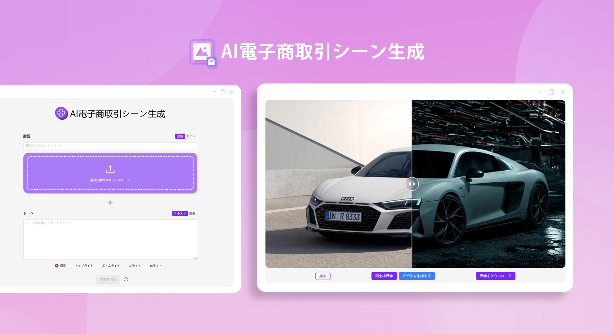
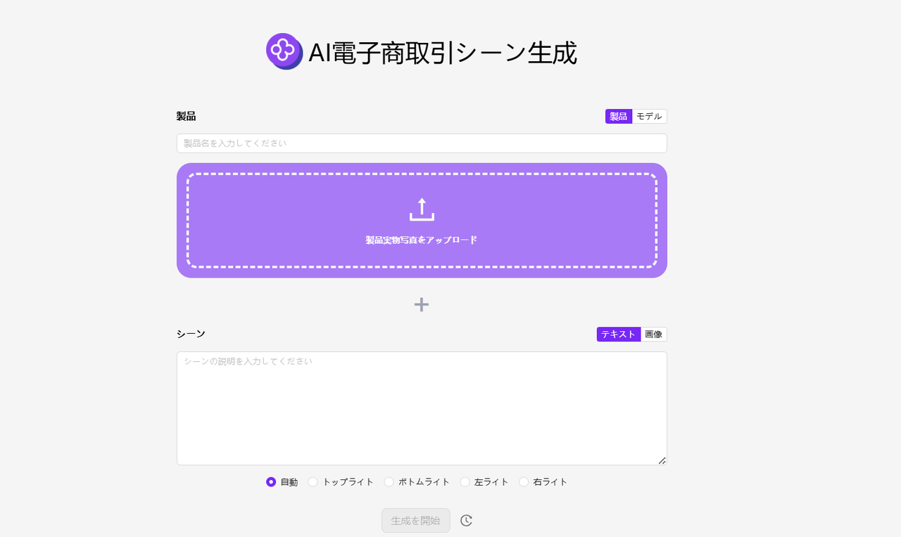
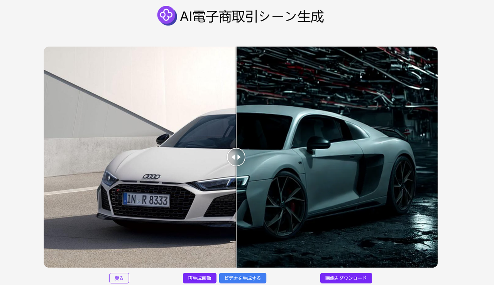

# 
🎥 AI電商シナリオ画像生成器🚀✨

AI 電子商取引シーン画像生成器は、ユーザーが提供する商品画像またはモデル画像を元に、さまざまなシーンの説明と組み合わせて再照明を行い、電子商取引やその他の業界に適用可能な色調が一致した商品画像を生成することができます。また、シーン画像のビデオを生成することもできます。

<a href="README_zh.md">中文</a> | <a href="README.md">English</a> | <a href="README_ja.md">日本語</a>

 

これは[302.AI](https://302.ai)の[AI電商シナリオ画像生成器](https://302.ai/ja/tools/ecom1/)のオープンソース版です。302.AIに直接ログインして、コードや基礎知識なしでオンライン版を使用するか、自分のニーズに合わせて変更し自分でデプロイできます。

## インターフェースプレビュー
提供された商品画像またはモデル画像を元に、シーンの説明と組み合わせて画像に二次照明を行う。
     

電子商取引用のシーン画像を生成することができ、シーン画像のビデオを生成することもできます。

## プロジェクトの特性

### 🔆 二次照明
画像と文字の組み合わせを通じてモデル画像や商品画像を生成します。画像の二次照明をサポートしており、以下の照明モードを選択することができます。
- 自動
- 上部照明
- 下部照明
- 左側照明
- 右側照明 
### 🔄 タスク管理
タスクの再生成がサポートされています。
### ⚙️ 複数モデルのサポート
様々なモデルを選択して画像を拡張し、ビデオを生成することができます。
### 📜 履歴記録
あなたの創作履歴が保存され、記憶が失われることはありません。いつでもどこでもダウンロードすることができます。
### 🌍 多言語サポート
中国語インターフェース
英語インターフェース
日本語インターフェース

## 🚩 将来のアップデート計画
- [ ] 色の正確性と調和性を最適化する
- [ ] より多くのクリエイティブなシーンとスタイルを追加する

## 技術スタック
- Next.js 14 基礎フレームワーク

## 開発＆デプロイ

1. プロジェクトをクローン `git clone git@github.com:302ai/302_ecom_image_generator.git`
2. 依存関係をインストール `pnpm install`
3. 302のAPI KEYを設定 `.env.exampleを参照`
4. プロジェクトを実行 `pnpm dev`
5. パッケージングとデプロイ `docker build -t ecom_image_generator . && docker run -p 3000:3000 ecom_image_generator`

## ✨ 302.AIの紹介 ✨

[302.AI](https://302.ai)は、AIを用いた実践を解決するための、従量課金制のAIアプリケーションプラットフォームです。

1. 🧠 言語モデル、画像モデル、音声モデル、ビデオモデルなど、最新かつ全てのAI機能とブランドを集合しています。
2. 🚀 基本モデル上での深層アプリケーション開発を行っており、単なる対話ロボットではなく本当のAI製品を開発しています。
3. 💰 月額料金ゼロで、全機能が従量課金制で全面的に公開されており、敷居が低く、上限が高いです。
4. 🛠 強力な管理バックエンドを持ち、チームや中小企業向けに、一人が管理し多数の人が使用できます。
5. 🔗 すべてのAI機能はAPI接続を提供し、すべてのツールはオープンソースで自由にカスタマイズできます（進行中）。
6. 💡 強力な開発チームが毎週2〜3個の新しいアプリケーションをリリースし、製品を毎日更新しています。興味のある開発者もどうぞお問い合わせください。
