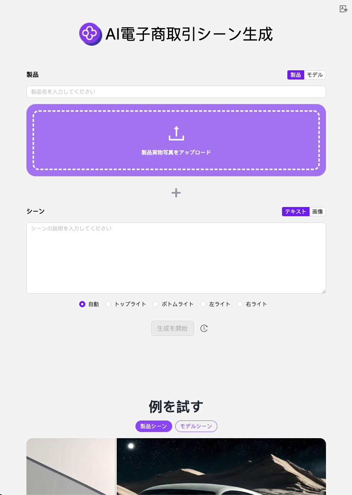

# 🎬🤖 302.AIのAI電商シナリオ画像生成器へようこそ！🚀✨

[中文](README_zh.md) | [English](README.md) | [日本語](README_ja.md)

これは[302.AI](https://302.ai)の[AI電商シナリオ画像生成器](https://302.ai/tools/ecom1/)のオープンソース版です。302.AIに直接ログインして、コードや基礎知識なしでオンライン版を使用するか、自分のニーズに合わせて変更し自分でデプロイできます。

## ✨ 302.AIの紹介 ✨

[302.AI](https://302.ai)は、AIを用いた実践を解決するための、従量課金制のAIアプリケーションプラットフォームです。

1. 🧠 言語モデル、画像モデル、音声モデル、ビデオモデルなど、最新かつ全てのAI機能とブランドを集合しています。
2. 🚀 基本モデル上での深層アプリケーション開発を行っており、単なる対話ロボットではなく本当のAI製品を開発しています。
3. 💰 月額料金ゼロで、全機能が従量課金制で全面的に公開されており、敷居が低く、上限が高いです。
4. 🛠 強力な管理バックエンドを持ち、チームや中小企業向けに、一人が管理し多数の人が使用できます。
5. 🔗 すべてのAI機能はAPI接続を提供し、すべてのツールはオープンソースで自由にカスタマイズできます（進行中）。
6. 💡 強力な開発チームが毎週2〜3個の新しいアプリケーションをリリースし、製品を毎日更新しています。興味のある開発者もどうぞお問い合わせください。

## プロジェクトの特性

1. 🎥 **AI電商シナリオ画像生成器**: 画像とテキストを組み合わせてモデル画像または製品画像を生成し、画像の二次ライティングをサポート、さらに画像生成を動画に拡張可能。
2. 🔄 **タスク管理**: タスクは再生成可能。
3. ⚙️ **多モデルサポート**: 様々なモデルを選んで動画を生成可能。
4. 📜 **履歴記録**: 創作履歴を保存し、記憶を失わず、いつでもどこでもダウンロード可能。
5. 🌐 **国際化**: 多言語対応で、現在は中国語、英語、日本語をサポート。

## 技術スタック

- Next.js 14 基礎フレームワーク

## 開発＆デプロイ

1. プロジェクトをクローン `git clone git@github.com:302ai/302_ecom_image_generator.git`
2. 依存関係をインストール `pnpm install`
3. 302のAPI KEYを設定 `.env.exampleを参照`
4. プロジェクトを実行 `pnpm dev`
5. パッケージングとデプロイ `docker build -t ecom_image_generator . && docker run -p 3000:3000 ecom_image_generator`

## インターフェースプレビュー

