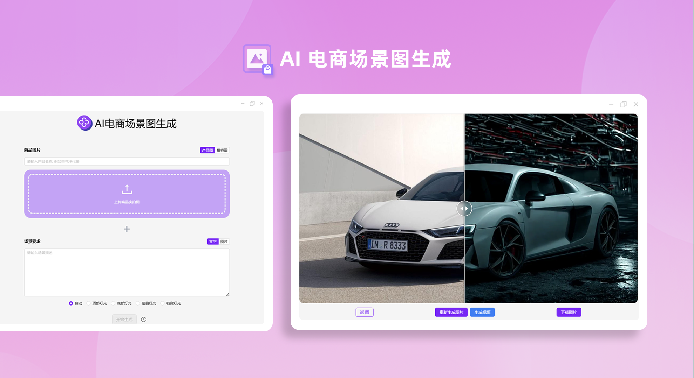
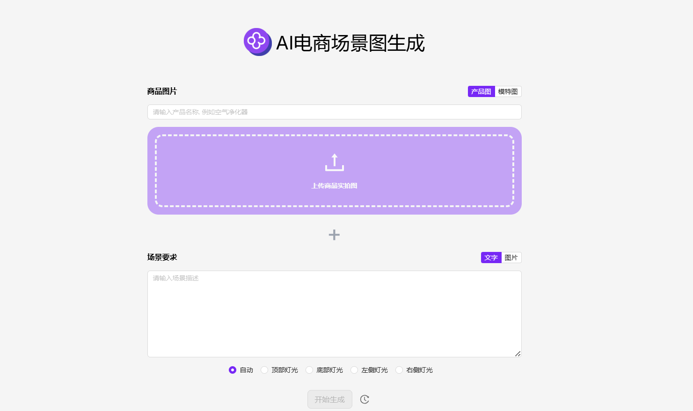
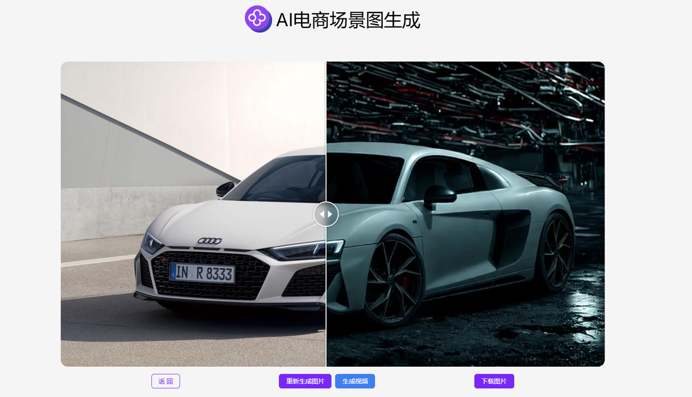

# 
🎥 AI电商场景图生成器 🚀✨

AI电商场景图生成器根据用户提供的产品图或模特图，结合不同的场景描述进行重新打光，生成适用于电商或其他行业的色彩一致的产品图片，还可以生成场景图视频。

<a href="README_zh.md">中文</a> | <a href="README.md">English</a> | <a href="README_ja.md">日本語</a>

这是来自[302.AI](https://302.ai)的[AI电商场景图生成器](https://302.ai/tools/ecom1/)开源版本。你可以直接登录302.AI，零代码零基础使用在线版本，或根据自己的需求修改并自行部署。

## 界面预览
根据提供的产品图或模特图，结合场景描述对图片进行二次打光。
     

生成电商场景图，还可以生成场景图视频。

## 项目特性
### 🔆二次打光
通过图片跟文字组合生成模特图或产品图，支持图片二次打光，可选以下打光模式：
  - 自动
  - 顶部灯光
  - 底部灯光
  - 左侧灯光
  - 右侧灯光
### 🔄 任务管理
  任务支持重新生成。
### ⚙️ 多模型支持
  可选择各种模型拓展图片生成视频。
### 📜 历史记录
  保存您的创作历史,记忆不丢失，随时随地都可以下载。
### 🌍 多语言支持
  - 中文界面
  - English Interface
  - 日本語インターフェース

## 🚩 未来更新计划
- [ ] 色彩准确性与协调性优化
- [ ] 添加更多创意场景与风格
  
## 技术栈
- Next.js 14 基础框架

## 开发&部署

1. 克隆项目 `git clone git@github.com:302ai/302_ecom_image_generator.git`
2. 安装依赖 `pnpm install`
3. 配置302的API KEY 参考.env.example
4. 运行项目 `pnpm dev`
5. 打包部署 `docker build -t ecom_image_generator . && docker run -p 3000:3000 ecom_image_generator`

## ✨ 302.AI介绍 ✨

[302.AI](https://302.ai)是一个面向企业的AI应用平台，按需付费，开箱即用，开源生态。✨

1. 🧠 集合了最新最全的AI能力和品牌，包括但不限于语言模型、图像模型、声音模型、视频模型。
2. 🚀 在基础模型上进行深度应用开发，我们开发真正的AI产品，而不是简单的对话机器人。
3. 💰 零月费，所有功能按需付费，全面开放，做到真正的门槛低，上限高。
4. 🛠 功能强大的管理后台，面向团队和中小企业，一人管理，多人使用。
5. 🔗 所有AI能力均提供API接入，所有工具开源可自行定制（进行中）。
6. 💡 强大的开发团队，每周推出2-3个新应用，产品每日更新。有兴趣加入的开发者也欢迎联系我们。
